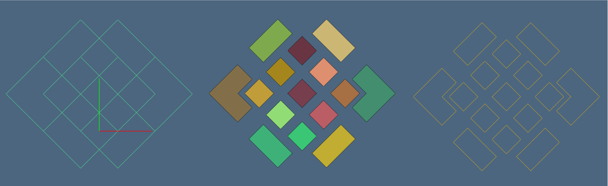
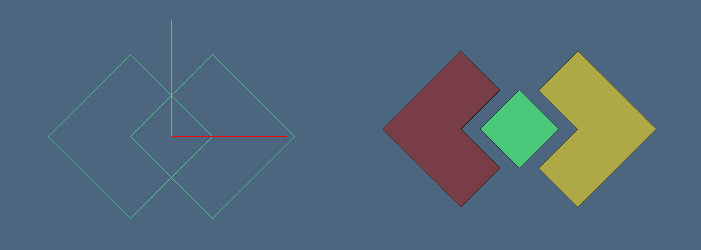

In the following examples we use three packages, for geometric computing and visualization of cellular complexes, respectively. Hence start by defining two shorter aliases:

```
julia> using LinearAlgebraicRepresentation

julia> Lar = LinearAlgebraicRepresentation
LinearAlgebraicRepresentation

julia> using ViewerGL

julia> GL = ViewerGL
ViewerGL

julia> using CAGD
```

## Cube generation as a `Model`

Here we first create the `Model` of a cube, actually a wrapping of vertices, edges and faces of a cellular complex created by the `Lar.cuboid` primitive, with minimum point `[-1,-1,-1]`, maximum point [1,1,1], and `true` flag for generation of all bases of its boundary complex.

```julia
julia> V,(VV,EV,FV,CV) = Lar.cuboid([1,1,1],true,[-1,-1,-1])
```

Then we generate the `cube::Model` using the easiest generating method :

```julia
julia> cube = CAGD.Model(V,[EV,FV]);
```

The `cube` *geometry* in ``E^3`` is given by the $3\times 8$ `Float64` matrix

```julia
julia> cube.G
38 Array{Float64,2}:
 -1.0  -1.0  -1.0  -1.0   1.0   1.0   1.0  1.0
 -1.0  -1.0   1.0   1.0  -1.0  -1.0   1.0  1.0
 -1.0   1.0  -1.0   1.0  -1.0   1.0  -1.0  1.0
```

The internal representation of the `cube.T` *topology* is stored as:

```julia
julia> typeof(cube.T)
Array{SparseMatrixCSC{Int8,Int64},1}

julia> @show map(SparseArrays.findnz, cube.T);
map(SparseArrays.findnz, cube.T) = Tuple{Array{Int64,1},Array{Int64,1},Array{Int8,1}}[([1, 5, 9, 1, 6, 10, 2, 5, 11, 2, 6, 12, 3, 7, 9, 3, 8, 10, 4, 7, 11, 4, 8, 12], [1, 1, 1, 2, 2, 2, 3, 3, 3, 4, 4, 4, 5, 5, 5, 6, 6, 6, 7, 7, 7, 8, 8, 8], [-1, -1, -1, 1, -1, -1, -1, 1, -1, 1, 1, -1, -1, -1, 1, 1, -1, 1, -1, 1, 1, 1, 1, 1]), ([1, 3, 1, 4, 2, 3, 2, 4, 1, 5, 1, 6, 2, 5, 2, 6, 3, 5, 3, 6, 4, 5, 4, 6], [1, 1, 2, 2, 3, 3, 4, 4, 5, 5, 6, 6, 7, 7, 8, 8, 9, 9, 10, 10, 11, 11, 12, 12], [1, 1, -1, 1, 1, -1, -1, -1, -1, 1, 1, 1, -1, -1, 1, -1, -1, -1, 1, -1, -1, 1, 1, 1]), ([], [], [])]
```
We can see the `Matrix` representation:

```julia
julia> map(Matrix, cube.T)
3-element Array{Array{Int8,2},1}:
 [-1 1  0 0; 0 0  0 0;  ; 0 0  1 0; 0 0  0 1]
 [1 -1  0 0; 0 0  0 0;  ; 0 0  1 0; 0 0  0 1]
 Array{Int8}(undef,0,6)                           
```

Or, more explicitly: $[\delta_0]$ : `V` $\to$ `E`

```julia
julia> Matrix(cube.T[1])
128 Array{Int8,2}:
 -1   1   0   0   0   0   0  0
  0   0  -1   1   0   0   0  0
  0   0   0   0  -1   1   0  0
  0   0   0   0   0   0  -1  1
 -1   0   1   0   0   0   0  0
  0  -1   0   1   0   0   0  0
  0   0   0   0  -1   0   1  0
  0   0   0   0   0  -1   0  1
 -1   0   0   0   1   0   0  0
  0  -1   0   0   0   1   0  0
  0   0  -1   0   0   0   1  0
  0   0   0  -1   0   0   0  1
```

and $[\delta_1]$ : `E` $\to$ `F`

```julia
julia> Matrix(cube.T[2])
612 Array{Int8,2}:
 1  -1   0   0  -1  1   0   0   0   0   0  0
 0   0   1  -1   0  0  -1   1   0   0   0  0
 1   0  -1   0   0  0   0   0  -1   1   0  0
 0   1   0  -1   0  0   0   0   0   0  -1  1
 0   0   0   0   1  0  -1   0  -1   0   1  0
 0   0   0   0   0  1   0  -1   0  -1   0  1
```

## `Struct` and `Model` assembly 

- The `Struct` type is used to aggregate hierarchically in world coordinates both geometric tuples and/or other `Struct` objects, defined in local coordinates, and (possibly) transformed  by affine maps, using homogeneous coordinates.
- The `Model` type is used to wrap geometry and topology of an object together, and jointly assign to a variable symbol.

In a next release `Struct` will be able to combine hierarchically any number of `Model` objects.

```julia
julia> assembly = Lar.Struct([ (V,EV,FV), Lar.t(1,1,1), Lar.r(π/16,0,0), (V,EV,FV) ]);

julia> typeof(assembly)
LinearAlgebraicRepresentation.Struct

julia> V,EV,FV = Lar.struct2lar(assembly);

julia> twocubes = CAGD.Model(V, [EV,FV]);
```

where we have, of course, `8+8` vertices, `12+12` edges, and `6+6` faces.  Notice that the number of 3-cell is yet undetermined (0), because `twocubes` is not a cellular complex (missing the boundary compatibility) but a collection of two (intersecting) cellular complexes. 

```julia
julia> twocubes.G
316 Array{Float64,2}:
 -1.0  -1.0  -1.0  -1.0   1.0   1.0    0.0  0.0  0.0  2.0  2.0  2.0  2.0
 -1.0  -1.0   1.0   1.0  -1.0  -1.0     0.0  2.0  2.0  0.0  0.0  2.0  2.0
 -1.0   1.0  -1.0   1.0  -1.0   1.0     2.0  0.0  2.0  0.0  2.0  0.0  2.0
 
julia> map(size, twocubes.T)
3-element Array{Tuple{Int64,Int64},1}:
 (24, 16)
 (12, 24)
 (0, 12) 
```
In order to create a well defined cellular complex, we must apply a pipeline of transformations, starting from object's fragmentation. Every face is split in 2D against all faces of possible intersection with it (using interval-trees). Solid cells are not yet reconstructed:

```julia
julia> split_model = CAGD.pairwise_decomposition(twocubes)
CAGD.Model([-1.0 -1.0 … 2.0 2.0; -1.0 -1.0 … 0.0 2.0; -1.0 1.0 … 2.0 2.0], SparseArrays.SparseMatrixCSC{Int8,Int64}[ ....

julia> size(split_model.G)
(3, 66)

julia> map(size,split_model.T)
3-element Array{Tuple{Int64,Int64},1}:
 (72, 66)
 (18, 72)
 (0, 18) 
```
Note that numbers of vertices, edges, faces, and cells were now 66, 72, 18, 0, respectively, since many are computed *independently* in multiple instances, starting from each face in 2D:

```julia
julia> congruent_model = CAGD.mergeModelVertices(split_model, signed_merge=true)

julia> displayModel(congruent_model)

julia> size(congruent_model.G)
(3, 22)

julia> map(size, congruent_model.T)
3-element Array{Tuple{Int64,Int64},1}:
 (36, 22)
 (18, 36)
 (0, 18) 
```
The numbers of vertices, edges, faces, and cells were now 2, 36, 18, 0, after having identified ``\epsilon``-congruent vertices, edges, and faces.

TODO ... continue

## Arrangements

### 2D Arrangement

Remember the definition:  an arrangement is the (regularized) $d$-space partition induced by a collection of geometric objects (cellular complexes) of dimension $d-1$.

Start by generating a grid ``4\times 4`` of unit squares, including all bases of their (cuboidal) complex.

```
julia> n,m = 2,2;
julia> V,(VV,EV,FV) = Lar.cuboidGrid([n,m],true);
julia> squares = V,FV,EV;
julia> q = sqrt(2);
```

Then build an assembly `twosquares` of type `Lar.Struct` of two `squares` instances, each rotated about the origin of `q` angle, and translated at both sides of the origin

```
julia> twosquares = Lar.Struct([ 
           Lar.Struct([ Lar.t(-q/4, -q/2 ), Lar.r(pi/4), squares ]),
           Lar.Struct([ Lar.t( q/4, -q/2 ), Lar.r(pi/4), squares ])
       ])
```

Then transform `twosquares` in a LAR tuple `(V,FV,EV)`, and visualize graphically the two superimposed grids and 

```
julia> V,FV,EV = Lar.struct2lar(twosquares);
julia> GL.VIEW([ GL.GLGrid(V,EV,GL.MayaColors[1],1), GL.GLFrame2 ]);
```

Now, let us remember that the input collection $\mathcal(S)$ to the arrangement pipeline is a set of `(d-1)`-complexes, here stored in the LAR array of arrays of vertex indices  `EV`, which generate a complete representation of the $E^2$ arrangement. 

The function `Lar.arrange2D`
does not return the geometric complex `V,(EV,FE)`, but a data structure `(V,FVs,EVs)` directly used for visualization, with separate arrays of faces and edges for each irreducible **atom** of the space partition.   

```
julia> V,FVs,EVs = Lar.arrange2D(V,EV);
julia> GL.VIEW(GL.GLExplode(V,FVs,1.5,1.5,1.,99,1));
julia> GL.VIEW(GL.GLExplode(V,EVs,1.5,1.5,1.,12,1));
```
Below we show (a) the input set $\mathcal{S}$ of 1D edges; (b) the exploded set of 2D atoms generated by $\mathcal{A}(\mathcal{S})$; (c) the 1D boundaries of the exploded set of atoms.


Wether replacing values of grid size in this example, we would obtain different arrangements of 2D space. For example:
```
julia> n,m = 1,1;
```


It may be of interest to note that the fairly complex geometries (even more the `2x2` grid) above where generated by $\mathcal{S} =$ (E,FV, EV) below:
```
julia> @show V,FV,EV = Lar.struct2lar(twosquares);
(V, FV, EV) = Lar.struct2lar(twosquares) = ([-0.3535534 -1.0606602 0.3535534 -0.3535534 0.3535534 -0.3535534 1.0606602 0.3535534; -0.7071068 0.0 0.0 0.7071068 -0.7071068 0.0 0.0 0.7071068], Array{Int64,1}[[1, 2, 3, 4], [5, 6, 7, 8]], Array{Int64,1}[[1, 2], [3, 4], [1, 3], [2, 4], [5, 6], [7, 8], [5, 7], [6, 8]])
```

### 3D Arrangement

The next example takes into consideration the $E^3$ arrangement generated by three cubes, translated, and/or rotated


```
V,(VV,EV,FV,CV) = Lar.cuboidGrid([1,1,1], true)
cube = V,FV,EV
threecubes = Lar.Struct([ cube,
	Lar.t(1,1,0), Lar.r(π/6,0,0),cube,
	Lar.t( -sqrt(2)/4, -sqrt(2)/4, 1/2 ), Lar.r(0,π/12,0),cube
])
V,FV,EV = Lar.struct2lar(threecubes)
```


```
GL.VIEW(GL.GLExplode(V,[[k] for k in FV],1.5,1.5,1.,99,0.6));
GL.VIEW(GL.GLExplode(V,[[k] for k in FV],1,1,1,99,0.6));
```

