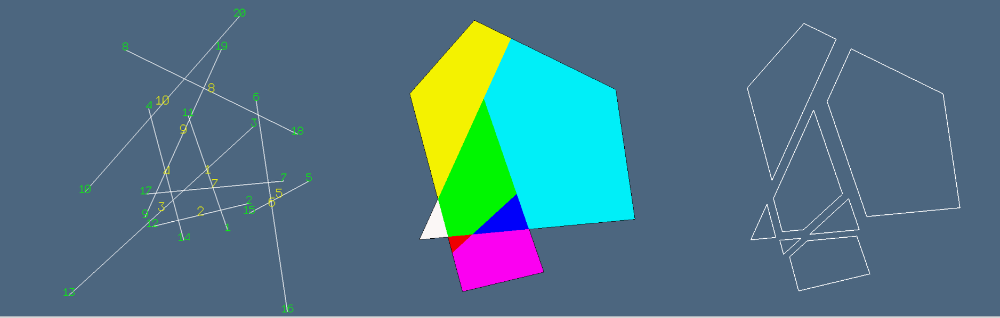
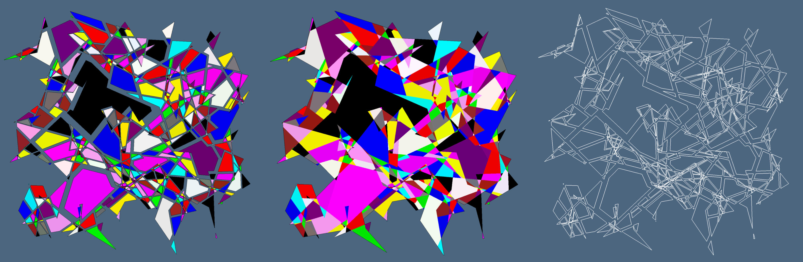

The word arrangement is used in combinatorial geometry and computational geometry and topology as a synonym of space partition.

Given a finite collection $\mathcal{S}$ of geometric objects in $\E^d$, the arrangement $\mathcal{A}(\mathcal{S})$ is the decomposition of $\E^d$ into connected open cells of dimensions $0, 1, \ldots , d$ induced by $\mathcal{S}$~\citep{Halperin:2017}. We are interested in the Euclidean space partition induced by a collection of PL cellular complexes.

The irreducible 2-cells of the 𝔼2 partition generated by random rectangles and by random polygonal approximations of the 2D circle. Take notice of the fact that 2-cells may be non convex and/or non contractible.
 

 
### Example

Here we compute and display the $E^2$ arrangement generated by some hundreds random line segments. As always we need the `LinearAlgebraicRepresentation` and `ViewerGL`
packages.

```
using LinearAlgebraicRepresentation
Lar = LinearAlgebraicRepresentation
using ViewerGL; GL = ViewerGL
```

#### Two functions
The function `randlines` is defined to produce `n` line segments in 2D, scaled by a $0\leq t\leq 1$ parameter.  The function returns the usual LAR model tuple `(V,EV)`, i.e. a (disconnected) graph, defined by arcs.
```
function randlines(n=300, t=0.4)
	V = zeros(Float64,2,2*n)
	EV = [zeros(Int64,2) for k=1:n]
	for k=1:n
		v1 = rand(Float64,2)
		v2 = rand(Float64,2)
		vm = (v1+v2)/2
		transl = rand(Float64,2)
		V[:,k] = (v1-vm)*t + transl
		V[:,n+k] = (v2-vm)*t + transl
		EV[k] = [k,n+k]
	end
	return V,EV
end
```
The function `arrangement2D` produces, via `fragmentlines`, a new set of smaller segments, split at intersection points outside of vertices. This one is now a planar graph, whatever is the input.  The function `biconnectedComponent` returns the pair `U,EVs`, to report all graph biconnected components. The 2D arrangement, or better its arrays af 2-cells and boundary 1-cells `(V,FVs,EVs)`  is finally computed by the `Lar.arrange2D` function.

```
function arrangement2D(V,EV)
	W,EW = Lar.fragmentlines((V,EV));
	U,EVs = Lar.biconnectedComponent((W,EW::Lar.Cells));
	EV = convert(Lar.Cells, cat(EVs))
	V,FVs,EVs = Lar.arrange2D(U,EV)
end
```

#### Spatial indexing of lines 

An example with only 10 lines, scaled twice to have a sufficient number of pairwise intersections is generated here. Below we show the $\mathcal{I}(\sigma)$ for each line $\sigma$.  Just note that each one has several others of possible intersection here, due to their elongated size. In normal geometric data the cardinality of each query is much smaller.
```
julia> V,EV = randlines(10,2.)
julia> Sigma = Lar.spaceindex((V,EV))
julia> [(k,tuple) for (k,tuple) in enumerate(Sigma)]

10-element Array{Tuple{Int64,Array{Int64,1}},1}:
 (1, [3, 10, 8, 9, 7, 2])      
 (2, [3, 9, 4, 1])             
 (3, [10, 8, 9, 7, 4, 2, 1, 5])
 (4, [3, 10, 8, 9, 7, 2])      
 (5, [3, 7, 6])                
 (6, [8, 7, 5])                
 (7, [3, 10, 9, 4, 1, 5, 6])   
 (8, [3, 10, 9, 4, 1, 6])      
 (9, [3, 10, 8, 7, 4, 2, 1])   
 (10, [3, 8, 9, 7, 4, 1])      

```

The set of lines and their numbers are shown below, together with the computed 2-cells of the space partition.

Visualization of different faces without explosion, and exploded boundaries of each 2-cell are generated as follows. the color parameter 99 induces a cyclic coloring with standard colors (white, red, green, blue, cyan, magenta, yellow, etc ... )

```
VV = [[k] for k=1:size(V,2)]
model = (V,[VV,EV])
meshes = GL.numbering(.5)(model, GL.COLORS[1], 1)
GL.VIEW(meshes);
```



#### Generating and viewing the arrangement

```
V,EV = randlines()
V,FVs,EVs = arrangement2D(V,EV)
```
The default set of random lines is generated, and  three images are displayed, with different explosion parameters. Notice that each array in `FVs` actually contains a CDT triangulation of a 2-face, needed for graphics display.

```
# native OpenGL visualization
GL.VIEW(GL.GLExplode(V,FVs,1.2,1.2,1.2,99,1));
GL.VIEW(GL.GLExplode(V,FVs,1.,1.,1.,99,1));
GL.VIEW(GL.GLExplode(V,EVs,1.2,1.2,1.2,1,1));
```




```