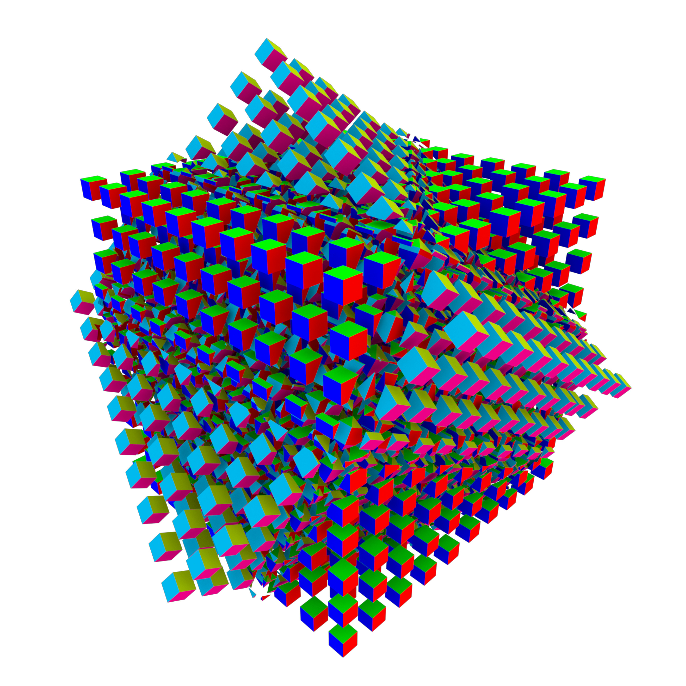
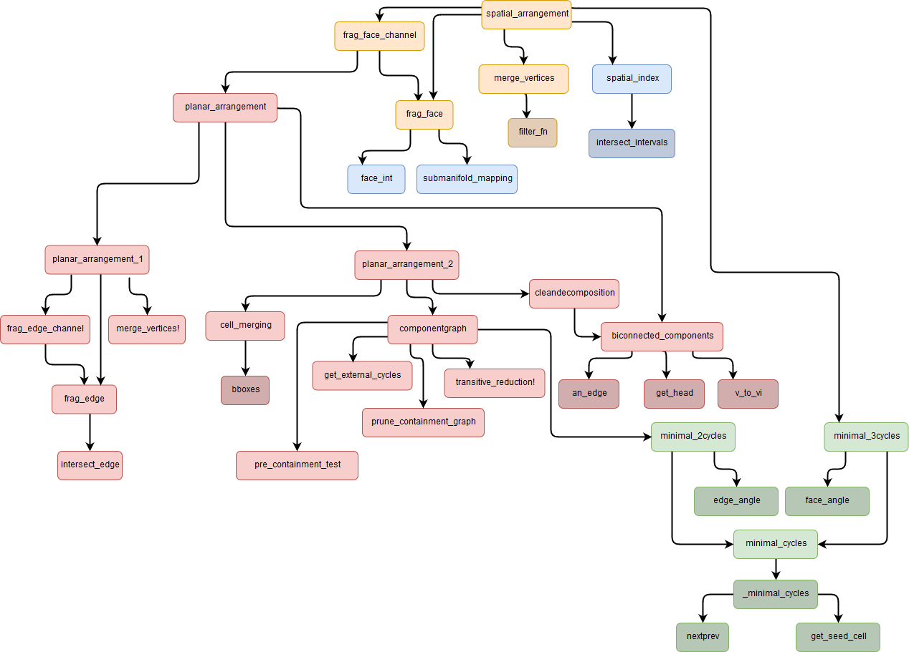
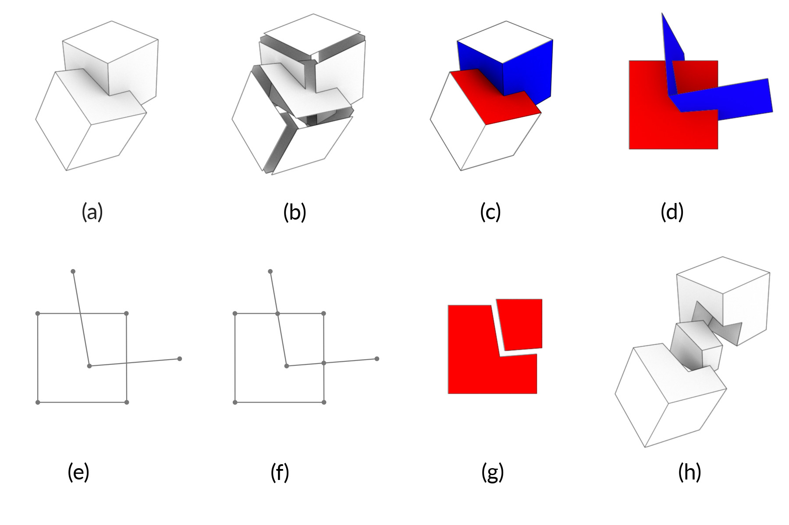

# Arrangement of cellular complexes

The **arrangement** is an algorithm which gets two general ``d``-dimensional cellular complexes and arranges them in a singular ``d``-dimensional cellular complex of which the cells respect the conditions:
*  ``\sigma_1 \cap \sigma_2 = \emptyset,\quad \forall`` couple of cells ``(\sigma_1, \sigma_2)``
*  ``\bigcup_i\sigma_i = \mathbb{E}^d``

This operation can be seen as a boolean union of two cellular complexes. Here an exploded visualization of the final result of the arrangement algorithm ran on 2 cubes made by ``10\times10\times10`` smaller cubes.


> **Figure 1:** Arrangement of ``2000=2\times10\times10\times10`` cubes

## Graph of recall functions
A graph is an ordered pair ``G(V,E)`` comprising a set ``V`` of vertices, nodes or points together with a set ``E`` of edges, arcs or lines, which are ``2``-elements subsets of ``V``. In this case, ``V`` is the set of functions of this sub-module and let ``v1``, ``v2`` be elements of ``V``, then ``e=v1v2`` ``\in`` ``E`` if ``v1`` calls ``v2``.
In the following graph the functions are arranged in colored boxes:

- yellow boxes is for `spatial_arrangement`
- red boxes is for `planar_arrangement`
- green boxes is for `minimal_cycles`
- blue boxes is for `dimension_travel`

Functions in darker boxes are declared only in the local scope of its father.

## API

Every functions strictly relative to the arrangement has been collected in the `Lar.Arrangement` sub-module but the two main functions are accessible directly from the `LinearAlgebraicRepresentation` namespace.

!!! warning
    `Lar.Arrangement` is the only place in `LinearAlgebraicRepresentation` where `Point` matrices store points per row and not per column as described in the documentation of `Lar.Points`


```@docs
Lar.spatial_arrangement
Lar.planar_arrangement
```

!!! note
    Even if the arrangement algorithm is theoretically dimension independent, we implemented "only" the ``d=2`` and ``d=3`` version of it.

## Theoretical basis

The algorithm is based on the concept of recursive problem simplification 
(a sort of *divide et impera* philosophy); if we have a ``d``-complex, for every
(``d-1``)-cell embedded into the ``\mathbb{E}^d`` euclidean space, we bring the cell,
and every other cell that could intersect it, down into ``\mathbb{E}^{d-1}``. We do this until
we reach the ``d=1`` in ``\mathbb{E}^1`` case; in here, we fragment all the ``1``-cells.
Then, we travel back to the original ``d``-dimension, and, for each
dimensional step, we build correct complexes from cells provided by the 
fragmentation of the lower dimension. 


> **Figure 2:** Algorithm overview

We have in input two cellular complexes [fig. 2, a], 
given as 2-skeletons, which are the sets of 2-cells 
[fig. 2, b, exploded]. Once we merged the skeletons, 
we individuate for each ``2``-cell (that we will call ``\sigma``)
all the other cells that could intersect it. We do this by computing
the spatial index: it is a mapping ``\mathcal{I}(\sigma)`` from a cell 
``\sigma`` to every other cell ``\tau`` of which ``box(\sigma) \cap box(\tau) \neq \emptyset``,
where the ``box`` function provides the axis aligned bounding box (AABB) of a cell [fig. 2, c, 
``\sigma`` in red and ``\mathcal{I}(\sigma)`` in blue]. The spatial arrangement
calculation is speeded up by storing the AABBs as dimensional wise intervals
into an interval tree ``\cite{interval_trees}``. 
Now for each cell ``\sigma`` we transform ``\sigma \cup \mathcal{I}(\sigma)`` 
in a way that ``\sigma`` lays on the ``x_3=0``  plane [fig. 2, d] and we find the intersections 
of the ``\mathcal{I}(\sigma)`` cells with ``x_3=0``  plane. So we have a "soup"
of 1-cells in ``\mathbb{E}^2`` [fig. 2, e], and we fragment each 1-cell 
with every other cell obtaining a valid 1-skeleton [fig. 2, f].
From this data it is possible to build the 2-cells using the ALGORITHM 1
presented and explored by Paoluzzi et al. ``\cite{Paoluzzi}``
[fig. 2, g, exploded]. The procedure to fragment 1-cells
on a plane and return a 2-complex is called *planar arrangement*. When the planar arrangement 
is complete, fragmented ``\sigma`` can be transformed back to its original position
in ``\mathbb{E}^3``. With every 2-cell correctly fragmented, we can use the 
already cited ALGORITHM 1 again to build a full 3-complex [fig. 2, h, exploded]. This is possible because ALGORITHM 1 is (almost) dimension independent.


### The "``1``-cells in ``\mathbb{E}^2``" base case


> **Figure 3:** Planar arrangement overview

This is our base case. We have called *planar arrangement*
the procedure to handle this case since
it literally arranges a bunch of edges laying on a plane.
So, in input there are 1-cells in ``\mathbb{E}^2`` and, optionally (but very
likely), the boundary of the original 2-cell ``\sigma`` 
[fig. 3, a, ``\sigma`` in red].
We consider each edge and we fragment it with every other edge. This brings to
the creation of several coincident vertices: these will be eliminated
using a KD-Tree [fig. 3, b, exploded]. 
At this point we have a perfectly fragmented 1-complex but many
edges are superfluous and must be eliminated; two kind of edges
are to discard: the ones outside the area of ``\sigma`` and the ones
which are not part of a maximal biconnected component 
(We can talk about biconnected components because we can consider the 1-skeleton as a graph: 
0-cells are nodes, 1-cells are edges and the boundary operator is
a incidence matrix.).
The result of this edge pruning outputs a
1-skeleton [fig. 3, c, exploded].

After this, 2-cells must be computed:
For each connected component we build a containment tree, which indicates
which component is spatially inside an other component.
Computing these relations lets us launch the ALGORITHM 1 \cite{Paoluzzi}
on each component and then combine the results to create 2-cells with non-intersecting 
shells [fig. 3, d, 2-cells numbered in green; please note that
cell 2 has cell 1 as an hole].
!!! note
    A 2-cell with a non-intersecting shell can be trivially defined
    as a "face with holes"; the correct definition is that it cannot 
    be shrunk to the dimension of a point.

## Main Interface

### Dimension travel

### Minimal cycles

```@docs
Lar.Arrangement.minimal_2cycles
```

```@docs
Lar.Arrangement.minimal_3cycles
```

### Planar arrangement

```@docs
Lar.Arrangement.intersect_edges
```

```@docs
Lar.Arrangement.frag_edge
```

```@docs
Lar.Arrangement.merge_vertices!
```

```@docs
Lar.Arrangement.biconnected_components
```

```@docs
Lar.Arrangement.get_external_cycle
```

```@docs
Lar.Arrangement.pre_containment_test
```

```@docs
Lar.Arrangement.prune_containment_graph
```

```@docs
Lar.Arrangement.transitive_reduction!
```

```@docs
Lar.Arrangement.componentgraph
```

```@docs
Lar.Arrangement.cell_merging
```

```@docs
Lar.Arrangement.cleandecomposition
```

```@docs
Lar.Arrangement.planar_arrangement_1
```

```@docs
Lar.Arrangement.planar_arrangement_2
```

### Spatial arrangement


