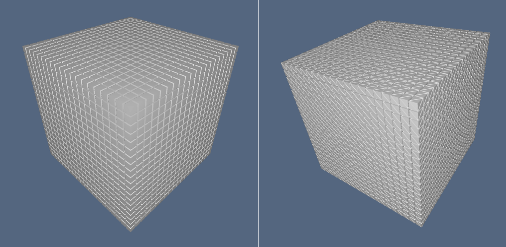
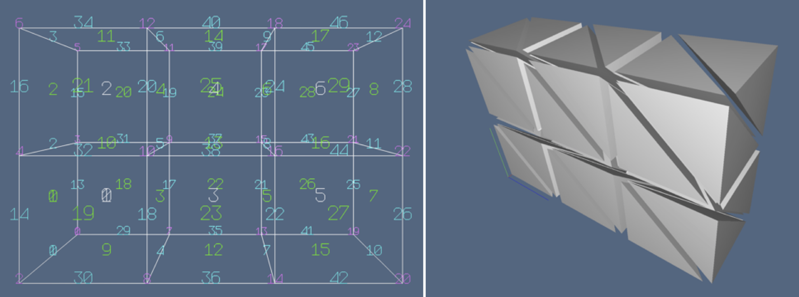
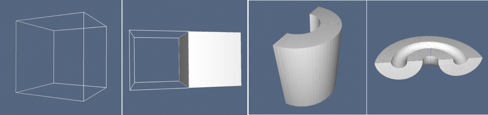

# Solid primitives by domain mapping

The `mapper.jl` file contains the implementation of several parametric primitives, including curves, surfaces and solids embedded in either 2D or 3D.

The constructive approach is common to all methods. It consists in generating a simplicial or cuboidal decomposition of a simple geometrical domain in *u,v* or *u,v,w* parametric space. Then a change of coordinates, e.g. from Cartesian to polar or cylindrical coordinates, is applied to the vertices of the cellular complex decomposing the domain.


> **Figure 1:** Cellular 3-complexes, slightly exploded: (a) cuboidal mesh; (b) simplicial mesh.

So, the mapped domain produces a curved manifold in 2D or 3D space. To obtain a closed curved surface, i.e. a manifold-without-boundary, as in the case of a 2-sphere in 3D, or of the toroidal surface in 3D, a suitable identification of coincident mapped points is performed. 

### Basics of LAR models

A very simple LAR model is a 2D `square` with a vertex on the origin: 

```julia
julia> square=([[0.; 0] [0; 1] [1; 0] [1; 1]], [[1,2,3,4]], [[1,2], [1,3], [2,4], [3,4]])
([0.0 0.0 1.0 1.0; 0.0 1.0 0.0 1.0], Array{Int64,1}[[1, 2, 3, 4]], Array{Int64,1}[[1, 2],
[1, 3], [2, 4], [3, 4]])

```

Conventional names for the arrays of vertices, faces and edges:

```julia
julia> V,FV,EV = square
([0.0 0.0 1.0 1.0; 0.0 1.0 0.0 1.0], Array{Int64,1}[[1, 2, 3, 4]], Array{Int64,1}[[1, 2],
[1, 3], [2, 4], [3, 4]])
```

`V` may be either of type `Array{Float64,2}` or `Array{Int64,2}`

```julia
julia> Lar = LinearAlgebraicRepresentation

julia> V::Lar.Points
2×4 Array{Float64,2}:
 0.0  0.0  1.0  1.0
 0.0  1.0  0.0  1.0
```
The arrays containing the $p$-dimensional ($2\leq p\leq d$) cells of a $d$-complex
must be of type Array{Array{Int64,1},1}, where each element contains the *unordered* array
of indices of vertices on the boundary of the cell:

```julia
julia> EV::Lar.Cells
4-element Array{Array{Int64,1},1}:
 [1, 2]
 [1, 3]
 [2, 4]
 [3, 4]
```
### *Cuboidal* and *simplicial* grids

`LinearAlgebraicRepresentation`, as its ancestor geometric language `PLaSM` and its father library `pyplasm` aims
to be multidimensional. Hence some functions generate geometric models of varying
dimensions. Important examples are `cuboidGrid` and `simplexGrid`, whose unique parameter
is the *shape* of the generated mesh, i.e. the number of $d$-dimensional cells in each
dimension, with `d = length(shape)`. The vertices of the mesh stay on the integer grid of
suitable dimension and size.

```julia
julia> shape = [1,1,1]

julia> Lar.cuboidGrid(shape)
([0.0 0.0 … 1.0 1.0; 0.0 0.0 … 1.0 1.0; 0.0 1.0 … 0.0 1.0], 
Array{Int64,1}[[1, 2, 3, 4, 5, 6, 7, 8]])
```
Hence we have, for single-cell 1-, 2-, 3-, and 4-dimensional LAR models:

```julia
julia> Lar.cuboidGrid([1])
([0.0 1.0], Array{Int64,1}[[1, 2]])

julia> Lar.cuboidGrid([1,1])
([0.0 0.0 1.0 1.0; 0.0 1.0 0.0 1.0], Array{Int64,1}[[1, 2, 3, 4]])

julia> Lar.cuboidGrid([1,1,1])
([0.0 0.0 … 1.0 1.0; 0.0 0.0 … 1.0 1.0; 0.0 1.0 … 0.0 1.0], 
Array{Int64,1}[[1, 2, 3, 4, 5, 6, 7, 8]])

julia> Lar.cuboidGrid([1,1,1,1])
([0.0 0.0 … 1.0 1.0; 0.0 0.0 … 1.0 1.0; 0.0 0.0 … 1.0 1.0; 0.0 1.0 … 0.0 1.0],
Array{Int64,1}[[1, 2, 3, 4, 5, 6, 7, 8, 9, 10, 11, 12, 13, 14, 15, 16]])
```

Two examples follows for a  $20\times 20$  mesh in 2D, and a $20\times 20\times 20$   mesh
in 3D. Of course, their highest dimensional cells (*quads* and *hexs*) have 4 and 8
vertices, respectively.

```julia
julia> Lar.cuboidGrid([20,20])
([0.0 0.0 … 20.0 20.0; 0.0 1.0 … 19.0 20.0], Array{Int64,1}[[1, 2, 22, 23], [2, 3, 23,
24], [3, 4, 24, 25], [4, 5, 25, 26], [5, 6, 26, 27], [6, 7, 27, 28], [7, 8, 28, 29], [8,
9, 29, 30], [9, 10, 30, 31]  …  [415, 416, 436, 437], [416, 417, 437, 438], [417, 418,
438, 439], [418, 419, 439, 440], [419, 420, 440, 441]])

julia> Lar.cuboidGrid([20,20,20])
([0.0 0.0 … 20.0 20.0; 0.0 0.0 … 20.0 20.0; 0.0 1.0 … 19.0 20.0], Array{Int64,1}[[1, 2,
22, 23, 442, 443, 463, 464], [2, 3, 23, 24, 443, 444, 464, 465], [3, 4, 24, 25, 444, 445,
465, 466]  …   [8797, 8798, 8818, 8819, 9238, 9239, 9259, 9260], [8798, 8799, 8819, 8820,
9239, 9240, 9260, 9261]])
```

> **Figure 2:** Cellular 3-complexes: (a) cuboidal mesh, with  0-, 1-, 2-, and 3-cells numbered with different colors; (b) exploded simplicial mesh, with 6 tetrahedra (3-cells) per mesh cube.

Similarly, you can generate a multidimensional mesh of $d$-simplexes ($d=1,2,3,\dots$)
with the `simplexGrid` function, having as single parameter the (cuboidal) `shape` of the
mesh.

Let us generate $d$ (increasing in dimension) simplicial complexes partitioning a single hypercube $[0,1]^d$:

```julia 
julia> Lar.simplexGrid([1]) # one segment in [0,1] 
# output
([0.0 1.0], Array{Int64,1}[[1, 2]])

julia> Lar.simplexGrid([1,1]) # two triangles in [0,1]^2 
# output
([0.0 1.0 0.0 1.0; 0.0 0.0 1.0 1.0], Array{Int64,1}[[1, 2, 3], [2, 3, 4]])

julia> Lar.simplexGrid([1,1,1])  # six tetrahedra in [0,1]^3 
# output
([0.0 1.0 … 0.0 1.0; 0.0 0.0 … 1.0 1.0; 0.0 0.0 … 1.0 1.0], Array{Int64,1}[[1, 2, 3, 5],
[2, 3, 5, 6], [3, 5, 6, 7], [2, 3, 4, 6], [3, 4, 6, 7], [4, 6, 7, 8]])

julia> Lar.simplexGrid([1,1,1,1])  # 24 pentatopes in [0,1]^4 
# output
([0.0 1.0 … 0.0 1.0; 0.0 0.0 … 1.0 1.0; 0.0 0.0 … 1.0 1.0; 0.0 0.0 … 1.0 1.0],
Array{Int64,1}[[1, 2, 3, 5, 9], [2, 3, 5, 9, 10], [3, 5, 9, 10, 11], [5, 9, 10, 11, 13],
[2, 3, 5, 6, 10]  …  [4, 6, 7, 11, 12], [6, 7, 11, 12, 14], [7, 11, 12, 14, 15], [4, 6, 7,
8, 12], [6, 7, 8, 12, 14], [7, 8, 12, 14, 15], [8, 12, 14, 15, 16]]) 
```

Then look at the simplicial partition (3D triangulation) of the domain $[0,20]\times[0,20]\times[0,20] \subset \mathbf{R}^3$ shown in Figure 1b, and generated by the Julia expression below:

```julia 
julia> Lar.simplexGrid([20,20,20]) 
# output
([0.0 1.0 … 19.0 20.0; 0.0 0.0 … 20.0 20.0], Array{Int64,1}[[1, 2, 22], [2, 22, 23], [2,
3, 23], [3, 23, 24], [3, 4, 24], [4, 24, 25], [4, 5, 25], [5, 25, 26], [5, 6, 26], [6, 26,
27]  …  [415, 416, 436], [416, 436, 437], [416, 417, 437], [417, 437, 438], [417, 418,
438], [418, 438, 439], [418, 419, 439], [419, 439, 440], [419, 420, 440], [420, 440,
441]]) 
```

## List of currently available primitives

The mapper module aims to provide the tools needed to apply both dimension-independent affine transformations and general simplicial maps to geometric objects and assemblies developed within the LAR scheme.
A large number of surfaces and primitives solids are definable using the map function and the local parametrization.

### Curves

Primitive one-dimensional objects:

* `circle` - Circle centered in the origin
* `helix` - Helix curve about the z axis 

### Surfaces


> **Figure 3:** Cellular 1- and 2-complexes: (a) 2D unit circle; (b) spiral curve embedded in 3D; (c) 2D unit disk; (3) spiraloid surface in 3D.


Primitive two-dimensional objects:

* `disk` - Disk centered in the origin
* `helicoid` - Helicoid about the z axis
* `ring` - Ring centered in the origin
* `cylinder` - Cylinder surface with z axis
* `sphere` - Spherical surface of given radius
* `toroidal` - Toroidal surface of given radiuses
* `crown` - Half-toroidal surface of given radiuses


> **Figure 4:** Cellular 2- and 3-complexes: (a) 2D disk; (b) cylinder surface in 3D; (c) 2-sphere surface in 3D; (3) toroidal surface in 3D.

### Solids

Primitive three-dimensional objects:

* `cuboid` - Solid cuboid of given extreme vectors
* `ball` - Solid Sphere of given radius
* `rod` - Solid cylinder of given radius and height
* `hollowCyl` - Hollow cylinder of given radiuses and height 
* `hollowBall` - Hollow sphere of given radiuses
* `torus` - Solid torus of given radiuses
* `pizza` - Solid pizza of given radiuses


> **Figure 5:** Cellular complexes: (a) 1-skeleton of 3D cube; (b) assembly of cell complexes of mixed dimensions; (c) 3-mesh of portion of hollow solid cylinder; (d) 3-mesh of a portion of hollow solid torus.

## Implementation

The coding of the generating functions for the various geometric primitives follows the below guidelines:

*	 **Higher level function interface.** Every generating function is of type $$fun: parms_1 \to (parms_2 \to results),$$ with $parms_1=p_1\times p_2\times cdots \times p_m$ and $parms_2=q_1\times q_2\times cdots \times q_n$. The $p_i$ parameters concern the specification of the coordinate functions of the mapping. The $q_j$ parameters ($1\leq j\leq n\in\{1,2,3\}$)  affect the discretization of mapping domain.

*	 *Simplicial or cuboidal decomposition.*  Discretization primitives `simplexGrid()` or `cuboidGrid()` are used for the two cases. Both primitives are dimension-independent, i.e. may decompose 1D, 2D, 3D,..., nD domains, depending only on the array `shape` of the generated cellular complex. The complex is generated in LAR format `(vertices,cells)`, where vertices have integer coordinates. 

*	 *Coordinate functions.* Are applied to the integer `vertices`, so producing their
mapped instances and store them in a `Array{Array{Int64,1},1}`

*	*Complex simplification.* Finally, the geometrically coincident vertices are identified, the generated cells are translated to the new vertex indices, and cells are simplified from multiple identical indices. This may induce the *sewing* of domain boundaries according to expected topology of the curved manifold and/or the reduction of independent vertices in cells of the complex.

## Main Interface

### Curve primitives

```@docs
Lar.circle
```

```@docs
Lar.helix
```
### Surface primitives

```@docs
Lar.disk
```

```@docs
Lar.helicoid
```

```@docs
Lar.ring
```

```@docs
Lar.cylinder
```

```@docs
Lar.sphere
```

```@docs
Lar.toroidal
```

### Solid primitives

```@docs
Lar.cuboid
```

```@docs
Lar.ball
```

```@docs
Lar.hollowCyl
```

```@docs
Lar.hollowBall
```

```@docs
Lar.torus
```
